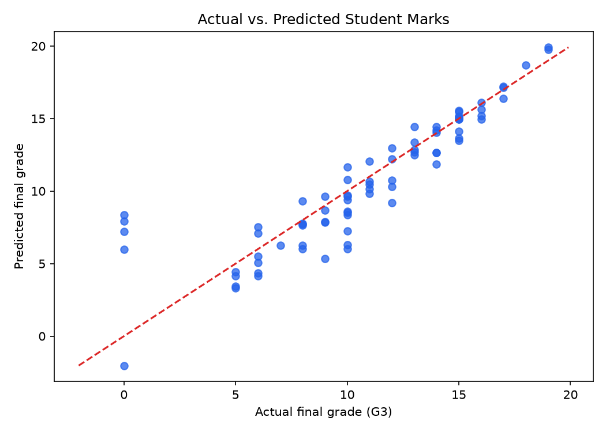

# 🎓 Student Marks Prediction (Linear Regression)

[](https://www.python.org/)
[](https://scikit-learn.org/)
[]()

## 📌 Project Overview
This project predicts the final mathematics grade (**G3**) of high school students on a scale of 0 to 20 using **Linear Regression**. It evaluates student performance based on historical grades, study time, past class failures, and school absences.

---

## 📊 Dataset Information
- **Source**: UCI Machine Learning Repository — [Student Performance Dataset](https://doi.org/10.24432/C5TG7T)
- **File**: `data/student-mat.csv`
- **Total Samples**: 395 student records

### Key Features Used:
- `studytime`: Weekly study time (1: <2 hrs, 2: 2 to 5 hrs, 3: 5 to 10 hrs, 4: >10 hrs)
- `failures`: Number of past class failures
- `absences`: Number of school absences (0 to 93)
- `G1`: First period grade (0 to 20)
- `G2`: Second period grade (0 to 20)
- **Target (`G3`)**: Final grade (0 to 20)

---

## ⚙️ Model & Implementation
- **Algorithm**: Linear Regression (`sklearn.linear_model.LinearRegression`)
- **Data Split**: 80% Training (316 rows), 20% Testing (79 rows), `random_state=42`
- **Feature Scaling / Processing**: Handled numeric feature inputs and checked missing values.

---

## 📈 Results & Evaluation

| Evaluation Metric | Score / Value |
|---|---|
| **Mean Absolute Error (MAE)** | **1.34 marks** |
| **Root Mean Squared Error (RMSE)** | **2.11 marks** |
| **Coefficient of Determination ($R^2$)** | **0.78** |

### Feature Coefficients:
- **`G2`**: +0.980 (Strongest predictor of final grade)
- **`G1`**: +0.144
- **`studytime`**: -0.071
- **`failures`**: -0.456 (Negative impact on final grade)

---

## 🖼️ Visualizations
The model generates an **Actual vs. Predicted** scatter plot comparing true final grades against model predictions:



---

## 🚀 How to Run

1. Navigate to the project directory:
   ```bash
   cd 01-Student-Marks-Prediction
   ```
2. Install dependencies:
   ```bash
   pip install -r requirements.txt
   ```
3. Run the prediction script:
   ```bash
   python student_marks_prediction.py
   ```
