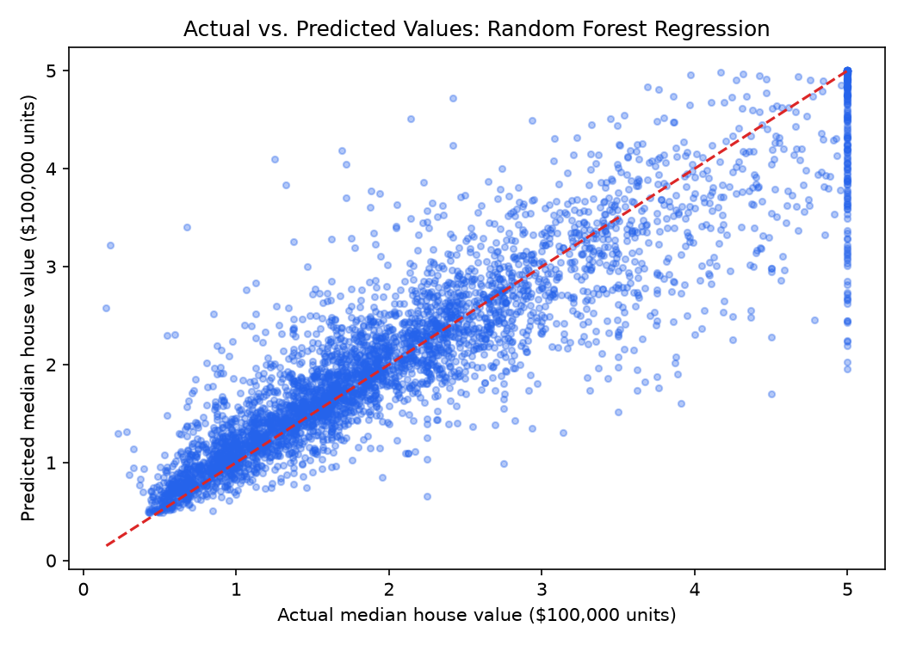

# 🏡 California House Price Prediction (Regression Benchmark)

[](https://www.python.org/)
[](https://scikit-learn.org/)
[]()

## 📌 Project Overview
This project benchmarks multiple regression techniques to predict median housing values across California districts. It compares baseline **Linear Regression** with **Random Forest Regression** to highlight the performance gains of ensemble tree-based models over non-linear geographical data.

---

## 📊 Dataset Information
- **Source**: StatLib / scikit-learn California Housing Dataset
- **File**: `data/california_housing.csv`
- **Total Samples**: 20,640 census block groups

### Features:
- `MedInc`: Median income in block group
- `HouseAge`: Median house age in block group
- `AveRooms`: Average number of rooms per household
- `AveBedrms`: Average number of bedrooms per household
- `Population`: Block group population
- `AveOccup`: Average number of household members
- `Latitude` / `Longitude`: Block group geographical coordinates
- **Target (`MedHouseVal`)**: Median house value (measured in $100,000s)

---

## ⚙️ Model & Implementation
- **Data Split**: 80% Training (16,512 rows), 20% Testing (4,128 rows), `random_state=42`
- **Models Evaluated**:
  1. **Linear Regression**: Baseline parametric model
  2. **Random Forest Regression**: Non-parametric ensemble of 100 decision trees (`n_estimators=100`)

---

## 📈 Results & Evaluation

| Model | MAE ($100k units) | MAE (Approx. USD) | RMSE ($100k units) | $R^2$ Score |
|---|---|---|---|---|
| **Linear Regression** | 0.533 | ~$53,320 | 0.746 | 0.576 |
| **Random Forest Regressor** | **0.328** | **~$32,754** | **0.505** | **0.805** |

> **Key Finding**: Random Forest Regression achieves an **$R^2$ score of 0.805**, significantly outperforming Linear Regression (0.576) by effectively capturing non-linear feature interactions and spatial coordinates.

---

## 🖼️ Visualizations
Scatter plot comparing actual vs. predicted values for the best performing model:



---

## 🚀 How to Run

1. Navigate to the project directory:
   ```bash
   cd 02-House-Price-Prediction
   ```
2. Install dependencies:
   ```bash
   pip install -r requirements.txt
   ```
3. Run the evaluation script:
   ```bash
   python house_price_prediction.py
   ```
