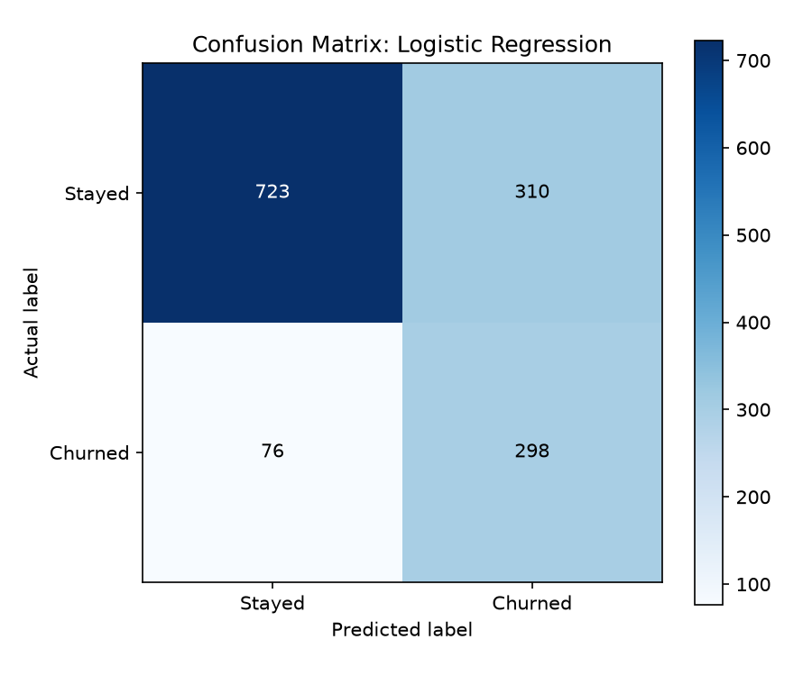

# 📉 Telco Customer Churn Prediction (Binary Classification)

[](https://www.python.org/)
[](https://scikit-learn.org/)
[]()

## 📌 Project Overview
Customer churn poses a major business challenge in telecom. This project builds a machine learning pipeline to predict customer churn based on subscription plans, payment methods, tenure, and demographics. It compares **Logistic Regression** (with class weighting) and **Random Forest Classification** to optimize retention targeting.

---

## 📊 Dataset Information
- **Source**: IBM Telco Customer Churn Dataset
- **File**: `data/Telco-Customer-Churn.csv`
- **Total Samples**: 7,032 active and former customer records
- **Base Churn Rate**: 26.6% (Imbalanced class distribution)

### Features Processed:
- **Numerical**: `tenure`, `MonthlyCharges`, `TotalCharges`
- **Categorical**: `Contract`, `PaymentMethod`, `InternetService`, `OnlineSecurity`, `TechSupport`, `PaperlessBilling`, etc.
- **Target (`Churn`)**: `1` (Churned), `0` (Stayed)

---

## ⚙️ Preprocessing & Pipeline Architecture
Using `sklearn.compose.ColumnTransformer` & `sklearn.pipeline.Pipeline`:
- **Numeric Features**: Imputed using median strategy + scaled via `StandardScaler`.
- **Categorical Features**: Imputed using most frequent strategy + One-Hot encoded (`handle_unknown="ignore"`).
- **Class Imbalance**: Addressed via `class_weight="balanced"` in classifiers.

---

## 📈 Results & Model Comparison

| Metric | Logistic Regression (Balanced) | Random Forest Classifier |
|---|---|---|
| **Accuracy** | 72.6% | **78.6%** |
| **Precision (Churn)** | 0.490 | **0.628** |
| **Recall (Churn)** | **0.797** | 0.479 |
| **F1 Score (Churn)** | **0.607** | 0.543 |
| **ROC-AUC Score** | **0.835** | 0.812 |

> **Key Takeaway**: For churn prevention, **Logistic Regression (Balanced)** is selected as the top model because it maximizes **Recall (79.7%)**, successfully capturing almost 80% of at-risk customers.

---

## 🖼️ Visualizations
The script evaluates the top model and generates a confusion matrix chart:



---

## 🚀 How to Run

1. Navigate to the project directory:
   ```bash
   cd 03-Customer-Churn-Prediction
   ```
2. Install dependencies:
   ```bash
   pip install -r requirements.txt
   ```
3. Run the prediction script:
   ```bash
   python customer_churn_prediction.py
   ```
