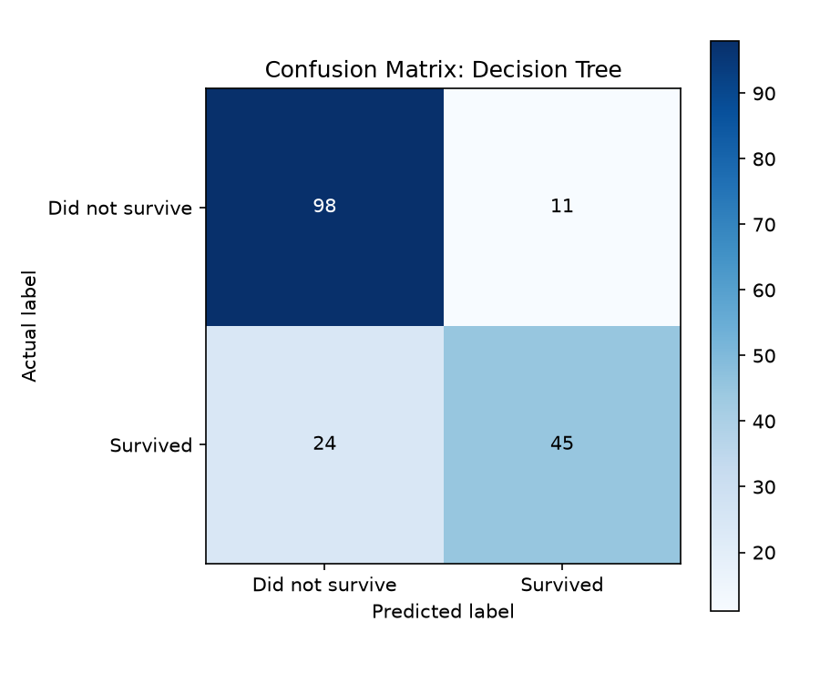

# 🚢 Titanic Survival Prediction (Classification Benchmark)

[](https://www.python.org/)
[](https://scikit-learn.org/)
[]()

## 📌 Project Overview
This classic machine learning project predicts passenger survival on the RMS Titanic based on demographic and voyage attributes such as ticket class, sex, age, family size, and fare paid. It compares **Logistic Regression** against a tuned **Decision Tree Classifier**.

---

## 📊 Dataset Information
- **Source**: OpenML / Kaggle Titanic Dataset
- **File**: `data/titanic.csv`
- **Total Samples**: 887 passenger records
- **Overall Survival Rate**: 38.6%

### Features Used:
- `Pclass`: Ticket class (1st = Upper, 2nd = Middle, 3rd = Lower)
- `Sex`: Gender (`male`, `female`)
- `Age`: Passenger age in years
- `Siblings/Spouses Aboard`: Number of siblings or spouses traveling together
- `Parents/Children Aboard`: Number of parents or children traveling together
- `Fare`: Passenger fare price paid
- **Target (`Survived`)**: `1` (Survived), `0` (Did not survive)

---

## ⚙️ Model & Implementation
- **Data Processing**: Pipeline transformation with `SimpleImputer`, `StandardScaler`, and `OneHotEncoder`.
- **Data Split**: 80% Training (709 passengers), 20% Testing (178 passengers), stratified by target class.
- **Models Evaluated**:
  1. **Logistic Regression**: Linear decision boundary classifier
  2. **Decision Tree Classifier**: Non-linear tree model (`max_depth=4`)

---

## 📈 Results & Evaluation

| Metric | Logistic Regression | Decision Tree (depth=4) |
|---|---|---|
| **Accuracy** | 77.5% | **80.3%** |
| **Precision (Survived)** | 0.723 | **0.804** |
| **Recall (Survived)** | **0.681** | 0.652 |
| **F1-Score (Survived)** | 0.701 | **0.720** |
| **ROC-AUC** | **0.853** | 0.841 |

> **Key Finding**: The **Decision Tree Classifier** achieved higher overall Accuracy (80.3%) and Precision (80.4%), effectively leveraging female gender and 1st/2nd class status as primary split rules.

---

## 🖼️ Visualizations
Confusion matrix visualization for the top model:



---

## 🚀 How to Run

1. Navigate to the project directory:
   ```bash
   cd 04-Titanic-Survival-Prediction
   ```
2. Install dependencies:
   ```bash
   pip install -r requirements.txt
   ```
3. Run the evaluation script:
   ```bash
   python titanic_survival.py
   ```
