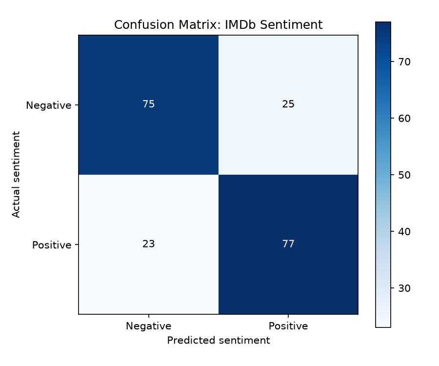

# 🎬 IMDb Movie Review Sentiment Analysis (NLP Classification)

[](https://www.python.org/)
[](https://scikit-learn.org/)
[]()

## 📌 Project Overview
This Natural Language Processing (NLP) project classifies movie reviews as either **Positive** or **Negative**. It builds an end-to-end NLP pipeline using **TF-IDF vectorization** paired with a **Logistic Regression** classifier.

---

## 📊 Dataset Information
- **Source**: Stanford Large Movie Review Dataset (IMDb)
- **File**: `data/imdb_reviews.csv`
- **Samples**: 1,000 labeled review samples (800 Train / 200 Test split)
- **Class Balance**: 50% Positive, 50% Negative

---

## ⚙️ NLP Pipeline Architecture

```
Raw Review Text ➔ Lowercase & Stopwords Removal ➔ TF-IDF Vectorization (Unigrams + Bigrams) ➔ Logistic Regression Classifier ➔ Sentiment Prediction
```

### Feature Extraction Parameters:
- `TfidfVectorizer`:
  - `lowercase=True`, English stop words removed
  - `ngram_range=(1, 2)` (Captures single words and word pairs)
  - `sublinear_tf=True` (Applies logarithmic term frequency scaling)
  - `max_features=30,000`

---

## 📈 Results & Evaluation

| Evaluation Metric | Score |
|---|---|
| **Accuracy** | **76.0%** |
| **Precision** | **0.755** |
| **Recall** | **0.770** |
| **F1 Score** | **0.762** |
| **ROC-AUC** | **0.845** |

### Sample Inference:
- **Input Text**: *"The story was entertaining, beautifully acted, and surprisingly moving."*
- **Model Output**: **Positive Sentiment** (Probability > 0.85)

---

## 🖼️ Visualizations
Confusion matrix chart showing test set classification breakdown:



---

## 🚀 How to Run

1. Navigate to the project directory:
   ```bash
   cd 05-Movie-Sentiment-Analysis
   ```
2. Install dependencies:
   ```bash
   pip install -r requirements.txt
   ```
3. Run the sentiment analysis model:
   ```bash
   python movie_sentiment_analysis.py
   ```
