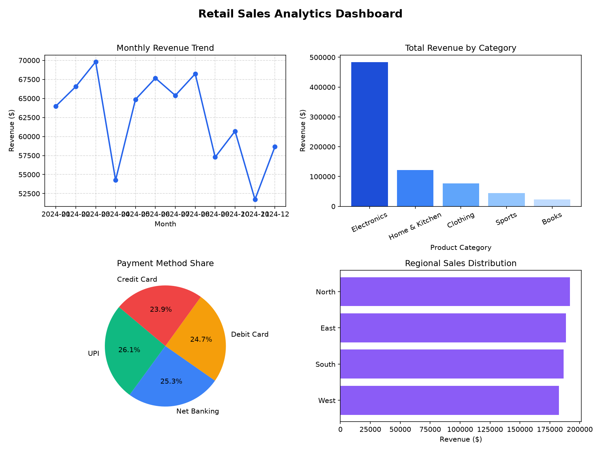

# 🛍️ Retail Sales Data Analysis & Dashboard (Pandas & Matplotlib)

[](https://www.python.org/)
[](https://pandas.pydata.org/)
[](https://matplotlib.org/)
[]()

## 📌 Project Overview
This project performs Exploratory Data Analysis (EDA) on retail sales transaction data using **Pandas**, **NumPy**, and **Matplotlib**. It tracks revenue growth trends, product category breakdowns, regional performance, and customer payment method preferences.

---

## 📊 Dataset Information
- **File**: `data/sales_data.csv`
- **Total Transactions**: 1,807 sales records
- **Time Period**: 1 Year Daily Transactions

### Features Analyzed:
- `Date`: Transaction date
- `Category`: Product category (`Electronics`, `Clothing`, `Home & Kitchen`, `Books`, `Sports`)
- `Region`: Geographic sales region (`North`, `South`, `East`, `West`)
- `Quantity` & `UnitPrice`: Order volume and individual pricing
- `TotalSales`: Computed transaction revenue
- `PaymentMethod`: `Credit Card`, `UPI`, `Debit Card`, `Net Banking`

---

## ⚙️ Analytical Workflow
1. **Data Ingestion & Cleaning**: Converted date strings to pandas datetime objects and extracted monthly period groups.
2. **Aggregations**: Computed total revenue, transaction counts, average order values, and category totals.
3. **Visualization Dashboard**: Created a 2x2 multi-panel layout showcasing trend lines, bar charts, pie charts, and horizontal comparisons.

---

## 📈 Key Business Insights

| Business Metric | Value |
|---|---|
| **Total Revenue** | **$749,115.13** |
| **Total Transactions** | **1,807 orders** |
| **Average Order Value (AOV)** | **$414.56** |
| **Top Revenue Category** | **Electronics ($483,625.33)** |

---

## 🖼️ Visualizations
Multi-panel analytics dashboard generated by the script:



---

## 🚀 How to Run

1. Navigate to the project directory:
   ```bash
   cd 06-Sales-Data-Analysis
   ```
2. Install dependencies:
   ```bash
   pip install -r requirements.txt
   ```
3. Run the sales analysis script:
   ```bash
   python sales_analysis.py
   ```
