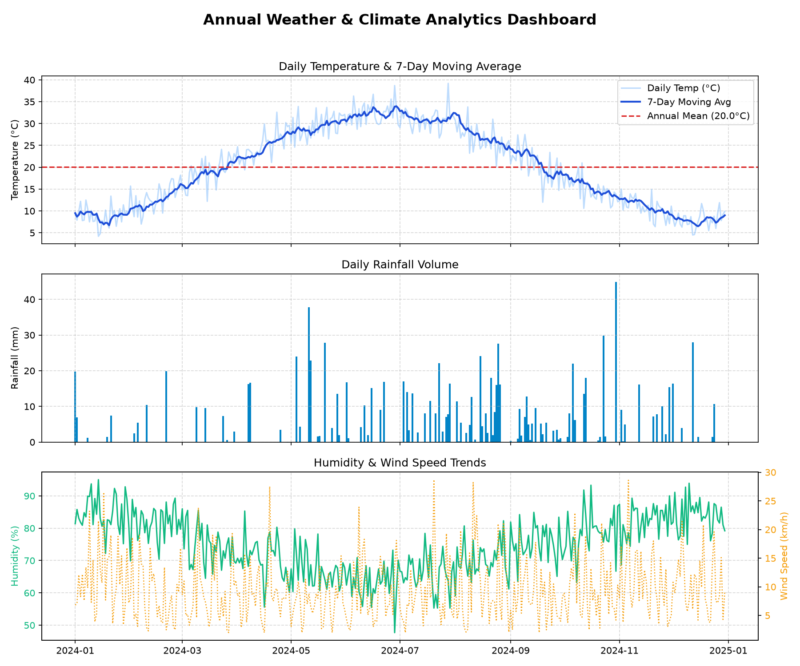

# 🌤️ Weather & Climate Time-Series Analytics (NumPy, Pandas & Matplotlib)

[](https://www.python.org/)
[](https://pandas.pydata.org/)
[](https://matplotlib.org/)
[]()

## 📌 Project Overview
This data analytics project processes 365 days of meteorological observation data using **NumPy**, **Pandas**, and **Matplotlib**. It computes 7-day rolling temperature moving averages, precipitation metrics, monthly climate summaries, and dual-axis humidity/wind speed trend visualizations.

---

## 📊 Dataset Information
- **File**: `data/weather_data.csv`
- **Observations**: 365 daily weather records

### Key Meteorological Features:
- `Date`: Daily observation date
- `Temperature_C`: Daily mean ambient temperature in °C
- `Humidity_Pct`: Relative atmospheric humidity (%)
- `Rainfall_mm`: Daily precipitation volume in millimeters
- `WindSpeed_kmh`: Surface wind speed in km/h

---

## ⚙️ Analytical Methods
- **Rolling Window Statistics**: 7-day centered moving average (`rolling(window=7)`) to smooth out daily thermal noise and highlight seasonal climate shifts.
- **Monthly Summary Aggregations**: Grouping by calendar month to extract mean temperature, total precipitation, and average humidity.
- **Dual-Axis Plotting**: Matplotlib `twinx()` implementation to visualize humidity vs. wind speed on separate vertical scales.

---

## 📈 Climate Insights Summary

| Metric | Recorded Value |
|---|---|
| **Mean Annual Temperature** | **20.0 °C** |
| **Max / Min Temperature** | **39.2 °C / 4.2 °C** |
| **Total Annual Rainfall** | **1,012.9 mm** |
| **Total Rainy Days** | **109 days** |
| **Wettest Month** | **August (165.2 mm)** |

---

## 🖼️ Visualizations
Multi-panel climate analytics dashboard generated by the script:



---

## 🚀 How to Run

1. Navigate to the project directory:
   ```bash
   cd 07-Weather-Data-Analytics
   ```
2. Install dependencies:
   ```bash
   pip install -r requirements.txt
   ```
3. Run the weather analytics script:
   ```bash
   python weather_analytics.py
   ```
